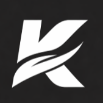

<p align="center">
  
</p>

<h1 align="center">KAL Browser</h1>

<p align="center">
  <strong>The Advanced Productivity Workstation for the Modern Web.</strong><br>
  Built with performance, privacy, and precision in mind.
</p>

---

## 🚀 Key Features

| Feature | Description |
| :--- | :--- |
| **📸 Snapshots** | Capture high-fidelity snapshots of any webpage directly from the address bar. |
| **📺 PIP Mode** | Seamless Picture-in-Picture for multi-tasking without losing focus. |
| **🛠️ Extensions** | Native support for advanced custom scripts and browser enhancements. |
| **🎨 Bento Shell** | A sleek, frameless UI designed for immersive productivity. |
| **📦 Pro Distribution** | Dual build support for standard installers and portable packages. |

## 🛠️ Getting Started

### Prerequisites
- [Node.js](https://nodejs.org/) (Recommended: Latest LTS)
- NPM

### Local Development
1. Clone the repository:
   ```bash
   git clone https://github.com/your-username/kal-browser.git
   ```
2. Install dependencies:
   ```bash
   npm install
   ```
3. Launch the browser:
   ```bash
   npm start
   ```

## 📦 Building & Distribution

KAL features an automated build pipeline. To package your browser, run:

### **`build_installer.bat`**

- **Option 1: Standard Installer (.exe)**: Creates a professional Windows setup file.
- **Option 2: Portable Version**: Generates a standalone folder for zero-install portability.

## 🔒 Security & Privacy

KAL is built as a secure shell around the Chromium engine via Electron. We prioritize local execution and never track your browsing history or snapshots.

## 🛠️ Technology Stack
- **Core**: Electron Framework
- **Logic**: Vanilla JavaScript
- **Styling**: Modern CSS3 (Bento Fluid Design)

---
<p align="center">
  Built for innovators. Powered by KAL.
</p>
